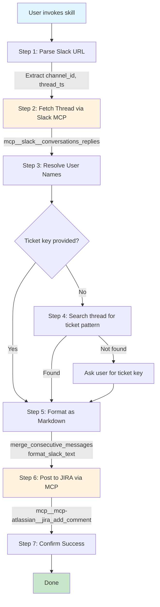

# Edited by Claude Code
# Upload Slack Thread to JIRA

Export Slack thread conversations to JIRA tickets as formatted markdown comments.

## Quick Start

```bash
/jira:upload-slack-thread <slack-thread-url> [ticket-key]
```

## Prerequisites

### 1. Slack MCP Server

Ensure the Slack MCP server is configured in your Claude Code settings with valid authentication tokens.

### 2. JIRA MCP Server

Ensure the JIRA MCP server is configured in your Claude Code settings with appropriate credentials.

## How It Works



## What This Does

1. **Parse URL** - Extract channel ID and thread timestamp from Slack URL
2. **Fetch Thread** - Use Slack MCP to get all messages in the thread
3. **Resolve Users** - Map user IDs to display names
4. **Find Ticket** - Use provided ticket or auto-detect from thread content
5. **Format Markdown** - Convert Slack formatting, merge consecutive messages
6. **Post Comment** - Use JIRA MCP to add formatted comment to ticket
7. **Confirm** - Report success with link to ticket

## Files

```
upload-slack-thread/
├── SKILL.md                    # Main skill documentation
├── README.md                   # This file
├── scripts/
│   ├── url_parser.py           # Slack URL parsing
│   ├── ticket_extractor.py     # JIRA ticket key extraction
│   ├── slack_fetcher.py        # Data models for Slack messages
│   ├── markdown_formatter.py   # Markdown formatting utilities
│   └── jira_comment_poster.py  # Data models for JIRA comments
```

## Usage Examples

### Basic Usage (with explicit ticket)

```
/jira:upload-slack-thread https://myworkspace.slack.com/archives/C09Q8MD1V0Q/p1769333522823869 JN-1234
```

### Auto-detect Ticket from Thread

```
/jira:upload-slack-thread https://myworkspace.slack.com/archives/C09Q8MD1V0Q/p1769333522823869
```
(Skill finds JIRA ticket key mentioned in the thread messages)

### With AI Summary

```
/jira:upload-slack-thread https://myworkspace.slack.com/archives/C09Q8MD1V0Q/p1769333522823869 JN-1234 --summary
```

## Output

The skill creates a JIRA comment with:

- **Header**: Export timestamp, Slack URL, channel name, message count
- **Summary** (optional): AI-generated summary of main topics
- **Transcript**: Full thread messages with timestamps and usernames

## Troubleshooting

### "Slack MCP unavailable"

Verify Slack MCP server is configured in Claude Code settings:
- Check `~/.claude/settings.json` or project settings
- Ensure authentication tokens are valid

### "JIRA MCP unavailable"

Verify JIRA MCP server is configured:
- Check MCP server configuration
- Ensure API tokens are valid

### "Invalid URL format"

Ensure the URL matches the pattern:
```
https://workspace.slack.com/archives/CHANNEL_ID/pTIMESTAMP
```

Example:
```
https://redhat-internal.slack.com/archives/C09Q8MD1V0Q/p1769333522823869
```

### "Unable to access JIRA ticket"

- Verify the ticket key format (e.g., `JN-1234`)
- Check you have permission to comment on the ticket
- Ensure JIRA MCP server is properly configured

### "Empty thread"

- Verify the thread URL points to a valid thread (not a channel)
- Check you have access to the Slack channel

## Slack URL Format

Slack thread URLs follow this pattern:

```
https://<workspace>.slack.com/archives/<CHANNEL_ID>/p<TIMESTAMP>
```

- **workspace**: Your Slack workspace subdomain
- **CHANNEL_ID**: Starts with C (public), G (private group), or D (DM)
- **TIMESTAMP**: 16-digit timestamp without decimal (e.g., `p1769333522823869`)

The skill converts `p1769333522823869` to `1769333522.823869` for the API.

## Support

For issues:
1. Check `SKILL.md` for detailed implementation documentation
2. Verify Slack MCP server is configured
3. Confirm JIRA MCP server is configured
4. Review error messages for specific guidance

## Version History

- **1.0.0** (2026-01-27) - Initial release
  - Slack MCP integration for thread fetching
  - Markdown formatting with Slack formatting conversion
  - JIRA MCP integration for comment posting
  - Auto-detection of JIRA ticket keys from thread content
