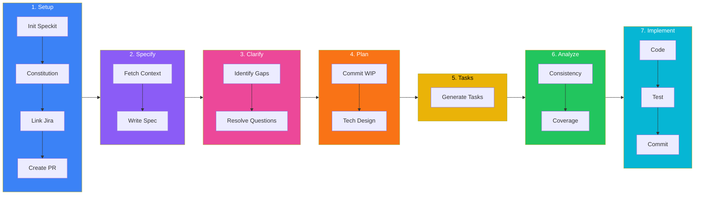
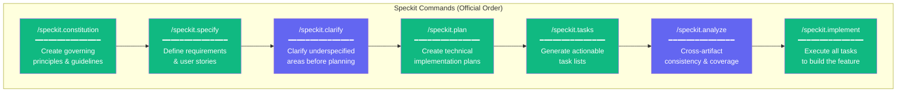
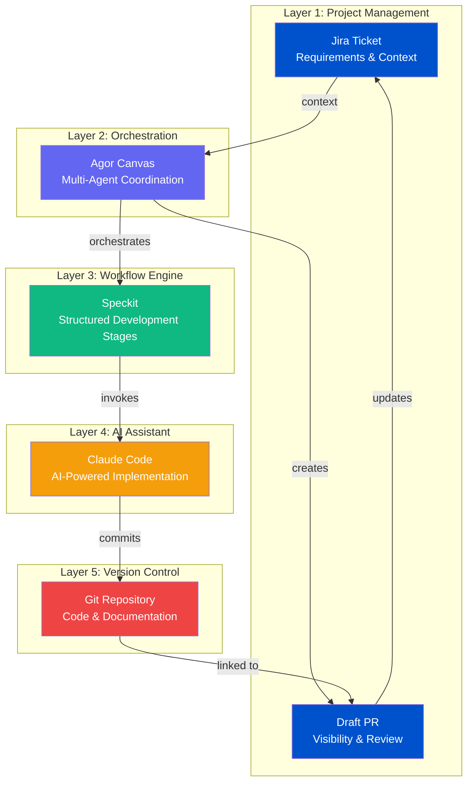
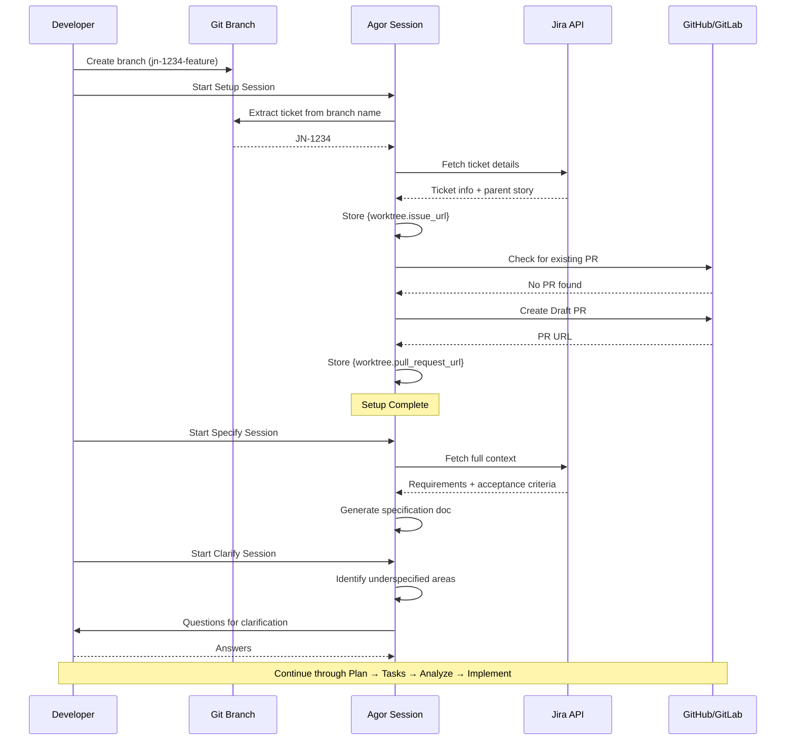

# Agor + Speckit Workflow Diagram

Interactive Mermaid diagram showing the complete Agor → Speckit → Jira workflow.

> **Reference**: Based on [GitHub Spec-Kit](https://github.com/github/spec-kit) workflow stages.

## Simplified Stage Flow

## Speckit Command Reference

## Data Flow Between Layers

## Jira Integration Flow

---

## Viewing These Diagrams

These Mermaid diagrams render automatically in:

- **GitHub/GitLab**: Markdown preview in repositories
- **VS Code**: With Mermaid extension installed
- **Mermaid Live Editor**: [mermaid.live](https://mermaid.live)
- **Documentation tools**: Docusaurus, MkDocs, etc.

To test or modify diagrams, copy the code blocks to [mermaid.live](https://mermaid.live) for interactive editing.
