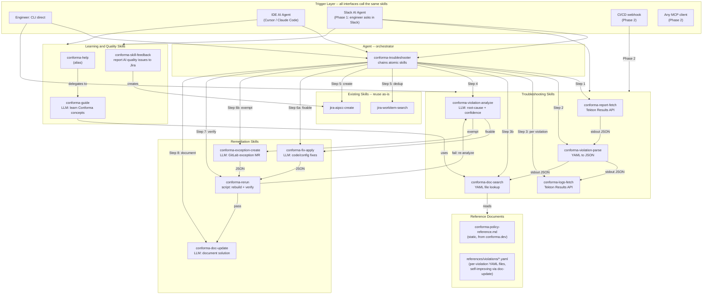
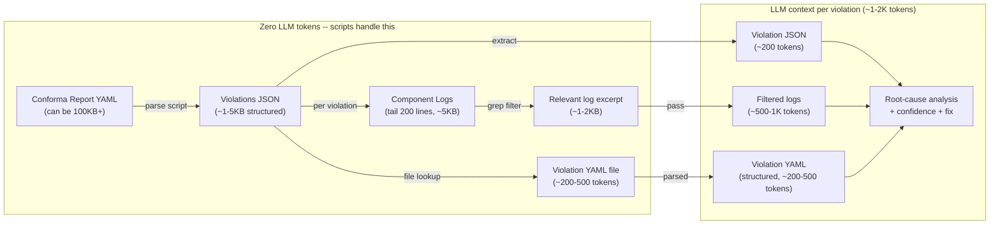
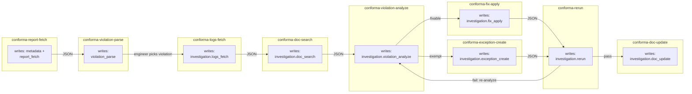
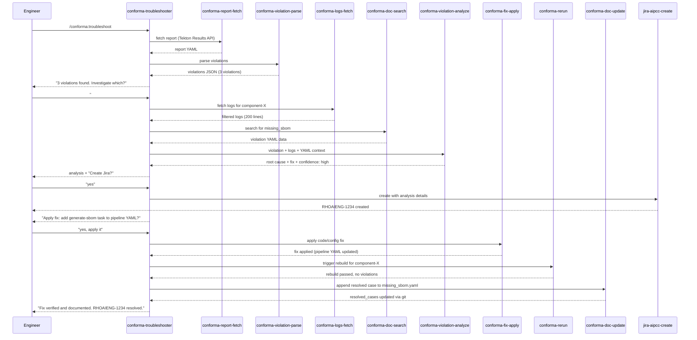
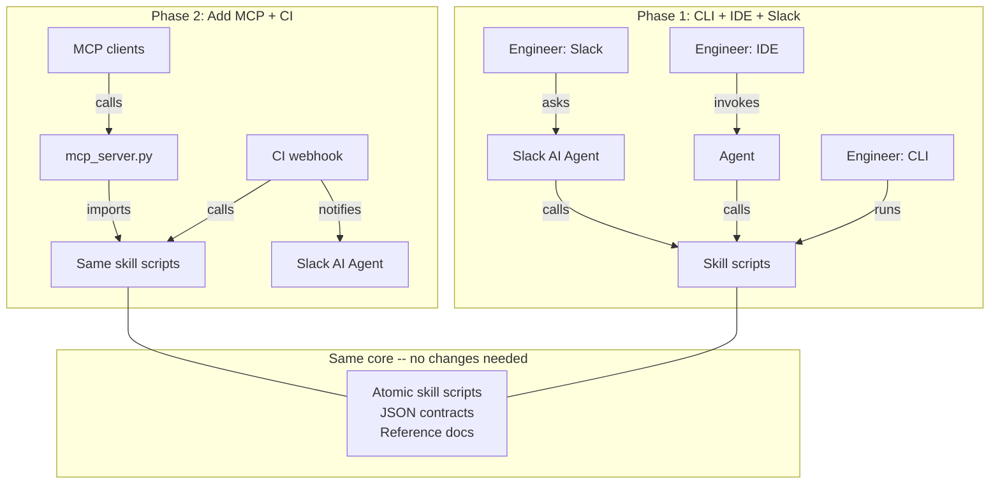

# Conforma Troubleshooter -- Design Document

Architecture, trade-offs, and phasing for the conforma-troubleshooter system.

## Starting Point: What Already Exists

Scripts in `rhoai-monitoring` (to be moved to a private GitHub repo):

- **Tekton Results API fetch** -- exists, fetches Conforma report data from the API
- **Violation parsing** -- exists but needs a new/improved parser for structured JSON output
- **Component log fetch** -- exists (same Tekton Results API), but needs the parser to tell it *which* logs to fetch
- **Jira creation** -- scripts exist, plus this repo has reusable skills (`jira-aipcc-create`, `jira-workitem-search`, etc.)
- **Documentation search** -- does NOT exist, needs to be designed

This system focuses on **wrapping and adapting** existing scripts, not rewriting them from scratch.

---

## The Landscape: MCP vs CLI+Skills vs Pure Skills

Recent evaluations (Arize AI, May 2026) show CLI-based tool-use outperforms MCP by **10-32x in token efficiency** while maintaining near-100% success rates. The industry consensus:

- **CLI+Skills** = best for domain-specific workflows where CLIs already exist (`kubectl`, `oc`, `yq`, `acli`)
- **MCP** = best for shared, authenticated, cross-platform tool distribution to multiple teams/clients
- **Pure Skills** = best for teaching AI *how* to think about a domain, not *how* to execute

The Conforma troubleshooter touches all three: deterministic execution (CLI), domain expertise (skills), and eventually cross-team distribution (MCP). The architecture starts with the most token-efficient approach and evolves to MCP when cross-team distribution matters.

## Core Design Principle: Python CLI Wrapping Existing Scripts, MCP-Ready from Day One

Wrap existing shell/Python scripts into **self-contained Python scripts** with Pydantic-validated JSON output:

- **Phase 1**: Engineers call scripts via CLI, IDE AI agents (Cursor/Claude Code), and Slack AI agent -- all three interfaces from day one
- **Phase 2**: MCP server + CI/CD automated triggering + confidence-gated Jira creation
- **All phases**: Same scripts, same JSON contracts, different interfaces (CLI, IDE, Slack, MCP, CI)

Existing scripts are imported/adapted, not rewritten. Python adds: type safety, structured JSON output, testability, and bridges to MCP and Slack.

---

## Architecture Diagram



---

## Token Budget



A raw Conforma report can be 100KB+. The scripts reduce it to ~1-5KB of structured violation data. Logs are tailed and grep-filtered. The violation YAML file is a direct file read by violation code -- no grep, no API, no network calls. The LLM sees ~1-2K tokens per violation, a 5-15x improvement over grep+full doc.

---

## Design Principles

- **One skill, one job**: each skill does exactly one thing. `fetch` fetches, `parse` parses, `analyze` analyzes.
- **Self-contained scripts**: each skill carries its own script. No shared Python package to manage.
- **Handover documents**: each skill produces a structured JSON handover document that serves as input for the next skill. The handover accumulates context as it flows through the pipeline.
- **DESIGN.md lives with the agent**: since it describes the overall system architecture and the agent is the orchestrator that ties everything together.

### Why Python Scripts (Not Shell)

- Type-safe inputs/outputs -- catches errors early, self-documents the JSON contracts
- Testable with pytest -- each script can be unit-tested with fixture data
- `subprocess.run(["kubectl", ...])` is equally deterministic to a shell script
- `ruff` linting is already in the repo's `make lint`
- For Phase 2 MCP: individual scripts can be wrapped as MCP tools, or a single `mcp_server.py` can import from all of them

---

## The Atomic Skills (Detail)

Each skill is self-contained with its own script. They communicate via structured JSON on stdout.

### `conforma-report-fetch` (wraps existing script)

- Input: `--namespace`, optionally `--component` or `--pipeline-run`
- Wraps: existing Tekton Results API fetch script from `rhoai-monitoring`
- **Must use Tekton Results API** -- not `kubectl logs`. Logs on the cluster are pruned aggressively shortly after PipelineRun completion.
- Reads from handover: `metadata` (namespace, pipeline_run)
- Writes to handover: `report_fetch` section (raw report path, status)
- Zero LLM tokens

### `conforma-violation-parse` (NEW -- the main piece to build)

- Runs: YAML parsing, extracts components + violations into structured JSON
- This is the critical handoff point -- everything downstream depends on this structured output
- Reads from handover: `report_fetch.raw_report_path` (the fetched report)
- Writes to handover: `violation_parse` section (violations list, count)
- Zero LLM tokens

### `conforma-logs-fetch` (wraps existing script)

- Wraps: existing Tekton Results API script
- **Must use Tekton Results API** -- same reason as `report-fetch`
- **Key handover sections**: `investigation.violation` (which component/pipeline-run to fetch logs for) and `metadata.namespace` (where to fetch from)
- Reads from handover: `metadata`, `investigation.violation`
- Writes to handover: `investigation.logs_fetch` section (logs text, line count)
- Zero LLM tokens

### `conforma-doc-search` (script-backed, deterministic)

- Runs: reads a YAML file from `references/violations/{violation_code}.yaml` -- direct file lookup, no grep, no API, no network
- If no exact file match: searches `patterns` fields across all YAML files for the violation's `msg` text (fallback)
- Also references static `references/conforma-policy-reference.md` for upstream conforma.dev docs
- Reads from handover: `investigation.violation`
- Writes to handover: `investigation.doc_search` section (violation_file path, violation_data as parsed YAML, related_files)
- Zero LLM tokens (file read is deterministic)

### `conforma-violation-analyze` (LLM-powered)

- LLM analyzes root cause, suggests fix, assigns confidence (high/medium/low)
- **Key handover sections (in priority order)**:
  1. `investigation.violation` -- the specific violation being analyzed (what went wrong)
  2. `investigation.logs_fetch.logs` -- component build logs (what actually happened)
  3. `investigation.doc_search.violation_data` -- structured YAML for this violation (known solutions, fix steps, symptoms, resolved cases)
  4. `violation_parse.violations` -- other violations in the same report (spotting patterns, e.g., "3 components all failing the same policy suggests a pipeline-level issue")
- Writes to handover: `investigation.violation_analyze` section (root cause, fix, confidence, evidence)
- ~1-2K tokens per violation

### `conforma-guide` (LLM-powered)

- Educational tool for engineers learning Conforma -- concepts, policies, violation types, workflows
- **Alias**: `conforma-help` -- thin wrapper that delegates to this skill
- Uses the YAML violation files + upstream `conforma-policy-reference.md` as grounding context
- Not used by the troubleshooting agent -- standalone skill engineers invoke directly

### `conforma-fix-apply` (LLM-powered with script support)

- Applies code and/or configuration fixes to address the root cause
- Fix types: code changes (Dockerfile, pipeline tasks), cluster/config changes (Tekton YAML, secrets, ConfigMaps)
- **Human-in-the-loop**: the agent MUST present the proposed fix and get engineer approval before applying
- Prerequisites: `investigation.violation_analyze` must be `completed`

### `conforma-exception-create` (LLM-assisted)

- Creates a GitLab MR to add a Conforma exception/waiver policy
- Fundamentally different from `fix-apply`: exempts the component from the policy rather than fixing the root cause
- **Human-in-the-loop**: MANDATORY -- exception MRs bypass policy enforcement
- Prerequisites: `investigation.violation_analyze` must be `completed`

### `conforma-rerun` (script-backed)

- Triggers a rebuild/pipeline run to verify the fix or exception worked
- If the rerun fails, the handover captures new violations so the agent can loop back to re-analyze
- Prerequisites: either `investigation.fix_apply` OR `investigation.exception_create` must be `completed`
- Zero LLM tokens

### `conforma-doc-update` (mostly deterministic, LLM-assisted for new violations)

- Documents verified solutions back into YAML violation files -- the self-improving feedback loop
- **Known violation** (YAML file exists): deterministic YAML append to `resolved_cases`, no LLM needed
- **New unknown violation** (no YAML file): LLM structures a new YAML file; engineer reviews via git MR
- Prerequisites: `investigation.rerun` must be `completed` with `result: "pass"`

### `conforma-skill-feedback` (LLM-assisted)

- Lets engineers report quality issues with any conforma-* skill
- Creates a Jira ticket with structured report; attaches the full handover as evidence
- Feeds back into improving `references/` docs and skill prompts

---

## Handover Document Pattern

Each atomic skill reads the current handover document, does its work, and writes an updated handover with its output added. This gives:

- **Debugging**: inspect the handover at any point to see what each skill produced
- **Resumability**: if a skill fails, restart from the last successful handover
- **Audit trail**: the final handover contains the complete chain of inputs, intermediate results, and analysis
- **Interface-agnostic**: the same handover works from CLI, IDE, Slack, or CI
- **Transparency**: engineers can read the handover to verify what the AI did

### Handover Schema

The handover is a single JSON document with **one clearly named section per skill**. Each section is a top-level key that only the owning skill writes to.

Two levels of sections:

- **Report-level sections** (`report_fetch`, `violation_parse`) -- run once per report
- **Investigation section** (`investigation`) -- focuses on one violation at a time

```json
{
  "metadata": {
    "pipeline_run": "string",
    "namespace": "string",
    "created_at": "ISO 8601 timestamp",
    "policy_source": "string"
  },

  "report_fetch": {
    "status": "completed | failed | pending",
    "completed_at": "ISO 8601 timestamp | null",
    "raw_report_path": "path to saved YAML file",
    "error": "string | null"
  },

  "violation_parse": {
    "status": "completed | failed | pending",
    "completed_at": "ISO 8601 timestamp | null",
    "violations": [
      {
        "component": "string",
        "container_image": "string",
        "rule": "string",
        "violation_code": "string",
        "msg": "string",
        "severity": "failure | warning"
      }
    ],
    "violation_count": "integer",
    "error": "string | null"
  },

  "investigation": {
    "violation_index": "integer (which violation is being investigated)",
    "violation": "copy of the selected violation object from violation_parse",

    "logs_fetch": {
      "status": "completed | failed | pending",
      "completed_at": "ISO 8601 timestamp | null",
      "logs": "string (filtered log text)",
      "log_lines": "integer",
      "error": "string | null"
    },

    "doc_search": {
      "status": "completed | failed | pending",
      "completed_at": "ISO 8601 timestamp | null",
      "violation_file": "string (path to matched YAML file)",
      "violation_data": "object (parsed YAML content)",
      "related_files": ["string (paths to related YAML files)"],
      "match_type": "exact | pattern | none",
      "error": "string | null"
    },

    "violation_analyze": {
      "status": "completed | failed | pending",
      "completed_at": "ISO 8601 timestamp | null",
      "root_cause": "string",
      "suggested_fix": "string",
      "confidence": "high | medium | low",
      "evidence": ["string"],
      "error": "string | null"
    },

    "fix_apply": {
      "status": "completed | failed | pending | skipped",
      "completed_at": "ISO 8601 timestamp | null",
      "fix_type": "code_change | cluster_config",
      "description": "string (what was changed and why)",
      "files_modified": ["string (file paths or k8s resource names)"],
      "requires_rebuild": "boolean",
      "error": "string | null"
    },

    "exception_create": {
      "status": "completed | failed | pending | skipped",
      "completed_at": "ISO 8601 timestamp | null",
      "mr_url": "string (GitLab MR URL)",
      "exception_policy": "string (the policy rule being exempted)",
      "justification": "string (why the exception is needed)",
      "error": "string | null"
    },

    "rerun": {
      "status": "completed | failed | pending",
      "completed_at": "ISO 8601 timestamp | null",
      "new_pipeline_run": "string (new PipelineRun name)",
      "result": "pass | fail | pending",
      "new_violations": ["violation objects if still failing"],
      "error": "string | null"
    },

    "doc_update": {
      "status": "completed | failed | pending | skipped",
      "completed_at": "ISO 8601 timestamp | null",
      "violation_file": "string (path to YAML file updated or created)",
      "update_type": "append_resolved_case | new_violation_file",
      "resolved_case_added": "object (the resolved_cases entry appended)",
      "error": "string | null"
    }
  }
}
```

### Handover Flow



### Handover Rules

1. Reads the full handover from stdin or `--handover FILE`
2. **Reads any section it needs** -- skills are not limited to the previous step's output
3. **Validates** that required sections have `"status": "completed"`:
   - `violation_parse` requires: `report_fetch`
   - `logs_fetch` requires: `violation_parse` + `investigation.violation` selected
   - `doc_search` requires: `violation_parse` + `investigation.violation` selected
   - `violation_analyze` requires: `investigation.logs_fetch` + `investigation.doc_search`
   - `fix_apply` requires: `investigation.violation_analyze` (mutually exclusive with `exception_create`)
   - `exception_create` requires: `investigation.violation_analyze` (mutually exclusive with `fix_apply`)
   - `rerun` requires: `investigation.fix_apply` OR `investigation.exception_create`
   - `doc_update` requires: `investigation.rerun` with `result: "pass"`
4. Does its work
5. **Writes ONLY its own section** -- never modifies another skill's section
6. Sets `status` to `"completed"` or `"failed"` with `error` message
7. Writes the updated handover to stdout or `--output FILE`

### Handover Example (After Two Steps)

```json
{
  "metadata": {
    "pipeline_run": "component-x-on-push-abc123",
    "namespace": "my-team-tenant",
    "created_at": "2026-05-10T14:32:00Z",
    "policy_source": "github.com/conforma/config//default"
  },
  "report_fetch": {
    "status": "completed",
    "completed_at": "2026-05-10T14:32:01Z",
    "raw_report_path": "/tmp/conforma-report-abc123.yaml",
    "error": null
  },
  "violation_parse": {
    "status": "completed",
    "completed_at": "2026-05-10T14:32:02Z",
    "violations": [
      {
        "component": "component-x",
        "container_image": "quay.io/org/component-x@sha256:abc...",
        "rule": "attestation_task.sbom_task_present",
        "violation_code": "missing_sbom",
        "msg": "SBOM not found for component",
        "severity": "failure"
      }
    ],
    "violation_count": 1,
    "error": null
  },
  "investigation": null
}
```

### Why JSON, Not Markdown

- **Parseable**: tools and scripts read/write without ambiguity
- **Validatable**: Pydantic / JSON Schema can validate at each step
- **Model-friendly**: LLMs read structured JSON more reliably than Markdown tables
- **Diffable**: JSON diff tools show exactly what each skill changed
- **Convertible**: JSON renders as Slack Block Kit, CLI table, or Markdown summary

---

## Documentation: YAML Per Violation (Deterministic Lookup)

Five options were considered. YAML per violation was chosen.

| Option | Approach | Token Cost | Verdict |
|--------|----------|------------|---------|
| A | RAG (Vector DB + Embeddings) | Low per query, high setup | Overkill for structured codes |
| B | Full-context LLM | 20-50K tokens | Wasteful and doesn't scale |
| C | Structured Markdown + grep | Medium | Good idea, but less parseable than YAML |
| D | Grep pointer + full context | 6-27K tokens | Superseded by Option E |
| **E** | **YAML per violation** | **200-500 tokens** | **Chosen** |

### Why YAML Per Violation Wins

Conforma violations have **structured, predictable identifiers** -- violation codes map directly to filenames: `references/violations/{violation_code}.yaml`. No grep, no API, no network calls, no auth. The format is:

- **Machine-parseable**: tools and scripts read/write without ambiguity
- **Validatable**: Pydantic / JSON Schema can validate each file
- **Self-improving**: `conforma-doc-update` appends to `resolved_cases` after each verified fix
- **Version-controlled**: changes go through git MRs, fully diffable
- **Token-efficient**: ~200-500 tokens per file vs ~6-27K for grep+full doc

### Violation YAML File Format

Each file lives at `references/violations/{violation_code}.yaml`:

```yaml
violation_code: missing_sbom
rule: attestation_task.sbom_task_present
patterns:
  - "SBOM not found for component"
  - "missing SBOM"
severity: failure

symptoms:
  - "Conforma report shows missing SBOM violation"
  - "Component build succeeded but SBOM task was skipped or failed"

root_cause: |
  The build pipeline is missing the generate-sbom task,
  or the task failed silently.

fix_steps:
  - "Check if generate-sbom task is present in the pipeline definition"
  - "If present, check TaskRun logs for the SBOM task"
  - "If missing, add the task to the pipeline YAML"
  - "Re-trigger the build"

exception_guidance: |
  Only if the component genuinely does not produce a container image
  (e.g., documentation-only repo). Create exception for rule
  attestation_task.sbom_task_present.

related:
  - url: "https://conforma.dev/docs/policy/..."
    label: "Conforma SBOM policy docs"
  - jira: "RHOAIENG-XXXX"

resolved_cases:
  - date: "2026-05-10"
    component: "component-x"
    namespace: "my-team-tenant"
    actual_root_cause: "generate-sbom task missing from .tekton/push.yaml"
    fix_applied: "Added generate-sbom task after build-container"
    fix_type: code_change
```

### When to Reconsider RAG

If the violation set grows past ~200 distinct codes AND new violations frequently appear with codes that don't match any existing file. At that point, add embeddings as a fallback alongside deterministic filename lookup.

---

## The Agent Workflow

1. Call `conforma-report-fetch` (zero tokens)
2. Pipe to `conforma-violation-parse` (zero tokens)
3. Present violation summary, let engineer pick one (or iterate all)
4. For selected violation: `conforma-logs-fetch` + `conforma-doc-search` (zero tokens)
5. Pass to `conforma-violation-analyze` (LLM tokens here)
6. Check for duplicate Jiras via `jira-workitem-search`, then create
7. **Remediation** (engineer approval required):
   - If fixable: `conforma-fix-apply`
   - If exempt: `conforma-exception-create`
8. `conforma-rerun` -- trigger rebuild, verify
9. If pass: `conforma-doc-update` -- document the verified solution
10. If fail: loop back to step 5 with new evidence

### Jira Integration

Reuses existing skills:

- **`jira-workitem-search`** -- dedup before creating (JQL: `text ~ "violation_code" AND project = PROJ`)
- **`jira-aipcc-create`** -- the `acli` pattern is reusable; may need a thin `conforma-jira-create` variant targeting the correct project
- **`jira-workitem-view`** / **`jira-workitem-comment`** -- link analysis back to existing tickets

---

## Phase 1 vs Phase 2

### Phase 1: CLI + IDE + Slack

Three interfaces, same skills underneath:



**Slack flow** follows the same pattern with Block Kit formatting and thread-based human-in-the-loop (engineer reacts/replies to approve actions). The Slack AI agent is a primary interface from day one, built with Python Bolt framework.

Token cost per violation: ~1-2K (analysis step). Everything else is deterministic scripts.

### Phase 2: Add MCP + CI Automation



1. **MCP**: `mcp_server.py` imports the same Python functions, adds `@mcp.tool()` decorators (~50 LOC)
2. **CI trigger**: pipeline calls scripts on Conforma failure, pipes to Slack bot
3. **Confidence-gated routing**: high confidence auto-creates Jira; low confidence posts to Slack for review

The atomic skill scripts, JSON contracts, and reference docs are **unchanged** across all interfaces.

---

## Why This Approach (vs Alternatives)

**CLI+Skills vs MCP-first:**
- CLI is 10-32x more token efficient (per Arize AI eval, 2026)
- CLI works without running a server process
- CLI is directly debuggable by engineers
- MCP adds value later for cross-team distribution, but is over-engineering for Phase 1

**Python CLI vs shell scripts:**
- Same determinism (both call `kubectl` via subprocess)
- Python adds: type safety, testability, Pydantic models that become MCP schemas for free
- `ruff` linting already in the repo
- Shell scripts can't easily evolve to MCP; Python can with 1-line decorators

**Single agent vs CLI+skill+agent:**
- Single agent burns tokens on YAML parsing, log fetching, doc searching
- CLI+skill+agent spends tokens only on root-cause analysis (~1-2K per violation vs 50K+)

---

## Implementation Order

Build bottom-up, one atomic skill at a time. Each can be tested independently.

1. **`conforma-report-fetch`** -- wrap existing Tekton Results API fetch script
2. **`conforma-violation-parse`** -- the most important new piece; write the structured JSON parser
3. **`conforma-logs-fetch`** -- wrap existing log fetch script
4. **`conforma-doc-search`** -- YAML file lookup + fallback pattern search; start with 5-10 known violations
5. **`conforma-violation-analyze`** -- LLM analysis; iterate on prompt quality with real data
6. **`conforma-fix-apply`** -- apply fixes based on analysis output
7. **`conforma-exception-create`** -- create GitLab exception MRs
8. **`conforma-rerun`** -- trigger rebuild and verify
9. **`conforma-doc-update`** -- document verified solutions in YAML files
10. **`conforma-guide`** -- educational skill; can be built and used independently
11. **`conforma-skill-feedback`** -- quality reporting; enables feedback loop from day one
12. **`conforma-troubleshooter` agent** -- wire all skills + Jira integration
13. **Slack AI Agent** -- Bolt-based bot, Block Kit formatting, thread-based human-in-the-loop
14. **Registry + validation** -- `categories.yaml`, `make update`, `make lint`
15. **(Phase 2)** -- MCP server, CI integration, confidence-gated automation

---

## Open Questions

- **Jira project/issue type**: which project and issue type for auto-created tickets? Does AIPCC make sense, or a different project (RHOAIENG, etc.)?
- **Conforma report sample**: a real report YAML would help nail down the `Violation` model fields and parser
- **Private repo structure**: how will the private GitHub repo (imported scripts) relate to this public repo?

## Resolved Questions

- **Tekton Results API vs kubectl logs**: must use Tekton Results API. Logs on Konflux are pruned aggressively after PipelineRun completion.
- **Google Docs conversion**: migrated to YAML per violation, Google Doc retired. Eliminates API auth, network calls, conversion heuristics, and format drift.
- **Documentation format**: YAML per violation. Token cost dropped from ~6-27K (grep+full doc) to ~200-500 tokens per violation.
